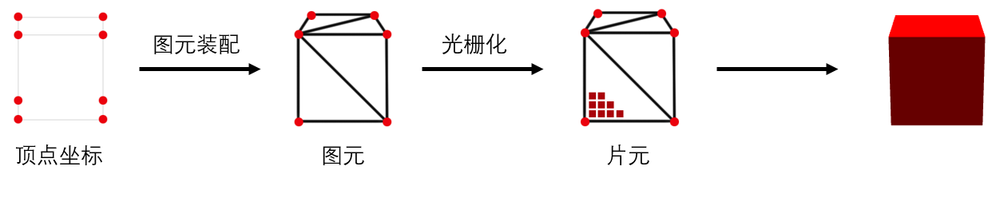

# 动画解决方案

动画内容是否是实时生成

|         | css | SVG | Video / gif | 图片定帧动画 | canvas | webgl | flash | Javascript + HTML |
| ------- | --- | --- | ----------- | ------------ | ------ | ----- | ----- | ----------------- |
|  使用率 | 5   | 5   | 4           | 2            | 4      | 3     | 1     | 2                 |
| 性能    | 3   | 3   | 3           | 3            | 4      | 5     | 2     | 2                 |

## SVG

#### SMIL

全称： Synchronized Multimedia Integration Language（同步多媒体集成语言）

SMIL 允许你做下面这些事情：

- 动画元素的数值属性（X, Y, …）
- 动画属性变换（平移或旋转）
- 动画颜色属性
- 沿着运动路径运动 （CSS 中已经可以使用 `offset-path` 实现相同的效果）
- 甚至支持简单的事件

最大的特点是：只要几个 animate 标签，不需要任何 CSS、JavaScript，就能写动画。

[https://codepen.io/shianqi/pen/qBaybaL](https://codepen.io/shianqi/pen/qBaybaL)

2015 年 4 月 Blink 小组打算放弃支持 SMIL, 推荐使用 CSS 动画和 Web 动画，主要原因有两个：

- "In terms of implementation, SMIL adds significant complexity to Blink"
- "Internet Explorer does not support SMIL which limited its use for critical functionality"

但后续这个计划终止了，可能和 IE 慢慢退出历史舞台有关吧（根本没有退出 

参考文章：

- [SVG animation with SMIL](https://developer.mozilla.org/en-US/docs/Web/SVG/SVG_animation_with_SMIL)
- [SMIL is dead! Long live SMIL! A Guide to Alternatives to SMIL Features](https://css-tricks.com/smil-is-dead-long-live-smil-a-guide-to-alternatives-to-smil-features/)
- [Is SMIL for SVG deprecated, un-deprecated or… paused but will eventually be deprecated?](https://stackoverflow.com/questions/64514150/is-smil-for-svg-deprecated-un-deprecated-or-paused-but-will-eventually-be-de)

#### SVG + CSS + JavaScript

将 SVG 当做普通的 DOM 使用，本质上还是 CSS/JavaScript 动画，放到后面讲

https://www.cnblogs.com/chuchur/p/10462282.html

[lottie-web](https://github.com/airbnb/lottie-web)
[react-lottie](https://github.com/chenqingspring/react-lottie)

#### 一些炫酷的例子：

- https://codepen.io/seanmccaffery/pen/xBpbG
- https://codepen.io/alistairtweedie/pen/GgPBqP

#### 推荐 SVG 动画库

- [Snap.svg](https://github.com/adobe-webplatform/Snap.svg)
- [GSAP](https://github.com/greensock/GSAP)

## JavaScript + HTML

通过 setInterval 或 setTimeout 方法的回调函数来持续调用改变某个元素的 CSS 样式以达到元素样式变化的效果。

JQuery 的 `animate()` 方法就是这种方式实现的。JavaScript 实现动画通常会导致页面频繁性重排重绘，性能不是很好

#### 优点

可以实现非常复杂的动画逻辑，但绝大多数可以结合 css3 做优化，提高动画流畅度

## CSS

#### css-transitions

#### css-animations

#### web-animations

polyfile: [web-animations-js](https://github.com/web-animations/web-animations-js)

https://animista.net/

性能

1.只动画化 transform 和 opacity

2.开发者工具

3.尽量少操作 dom

#### 如何让动画变的丝滑

如今的大多数设备都能达到每秒 60 次屏幕刷新，如果正在运行动画或者过渡，或者用户在滚动页面，则浏览器需要匹配设备的刷新率，为屏幕每一次刷新渲染新的一帧。所以每两帧之间大约有 16ms （1s / 60 ≈ 16.67ms） 的时间，但实际上浏览器内部也需要消耗一些时间，所以所有的计算需要在 10ms 内完成，如果无法完成则会导致帧率下降，导致动画不够丝滑。

我们将浏览器的 DOM 渲染简化，可以得到如下的流程图

#### 一些开源工具

https://github.com/michalsnik/aos

参考资料：

- [High Performance Animations](https://www.html5rocks.com/zh/tutorials/speed/high-performance-animations/)
- [Inside look at modern web browser (part 1)](https://developers.google.com/web/updates/2018/09/inside-browser-part1)
- [Inside look at modern web browser (part 2)](https://developers.google.com/web/updates/2018/09/inside-browser-part2)
- [Inside look at modern web browser (part 3)](https://developers.google.com/web/updates/2018/09/inside-browser-part3)
- [Inside look at modern web browser (part 4)](https://developers.google.com/web/updates/2018/09/inside-browser-part4)

## Video

可以通过控制视频的播放和暂停来实现一些复杂的动效，也可以播放一段然后通过 JavaScript 循环播放某一段

当视频文件较小时，可以通过 JavaScript 控制播放进度实现帧率较低的倒放，但整体性能不够。

还可以从视频中抽帧来获取数据，配合其他方式渲染，来进行数据压缩

#### 优点：

- 最终视觉效果很好，可以达到其他动画方式难以实现的效果

#### 缺点：

- 对网络环境要求高
- 制作成本高，修改不方便
- 由于视频格式的编码原理，码率高的视频倒放性能会跟不上

例子：

- [miui 12 官网](https://home.miui.com/)
- [为什么选我们-火山引擎](https://www.volcengine.cn/about)
- [火山引擎-教学互动解决方案](https://www.volcengine.cn/solution/interactive-teaching)

## gif

类似通过 Video 的方式，缺点是无法控制播放的进度，并且高清的 gif 体积较大，压缩后的体积小但是会失真严重。

https://www.seniverse.com/about

## Canvas

### Canvas 2D 渲染原理：

之所以叫 Canvas 2D 是为和 WebGL 或称为 Canvas 3D 区分，后续统一用 Canvas 代指 Canvas 2D。

Canvas 既可以用软件方法绘图，也可以使用 GPU 加速绘图，具体采用哪种方式需要看浏览器是否支持并且开启了硬件加速（目前大部分浏览器都是支持硬件加速的）。

以 WebKit 的 Chromium 为例，WebKit 中的图形上下文会创建一个 Skia 图形库提供的 SKCanvas 对象来处理 2D 图形操作请求，具体 SKCanvas 是否使用 GPU 加速取决于创建 SKCanvas 对象的时候是否传入 SKSurface_Gpu 对象。

如果是软件方法绘图，则会进行光栅化扫码的方法来绘制一个一个像素结果，最终会存入一个 SkBitmap 对象中。

如果是硬件加速绘图，同软件方法绘图不同的是，将 2D 图形操作转变为 GL 的操作，使用 3D 图形上下文来绘制，结果保存在 GPU 的内容缓冲区中。

#### 性能

看起来 Canvas 都能用硬件加速了，但是当自己用 Canvas 去实现一些复杂的动画的时候为什么感觉性能跟不上呢？

抛开代码写的比较菜，优化不够(，还有就是 Canvas 的设计本身就会出现性能损耗。Canvas 其实性能是损耗并不是图形库的问题，主要的性能损耗是在浏览器中损耗的，浏览器 Canvas 要保持跨平台兼容性，那么肯定要适配到多个通用图形封装库上，这里是一层封装，然后还要将这层封装暴露成 JavaScript Api，这里又要多一层封装。并且 JavaScript 的运行效率并不够高，正是这些原因导致 Canvas 相对要慢一些。

浏览器中的 Canvas 元素绘制的路径是这样的：

JavaScript 源代码

性能损耗最多的其实就在 JavaScript 引擎这里，况且很多 Canvas 动画或游戏还有许多计算逻辑

[JavaScript 引擎] JavaScript 源代码 -> 抽象语法树 -> 字节码(中间表示) -> JIT(全代码生成器) -> 本地代码（汇编）

参考文章：

[《WebKit 技术内幕》](https://book.douban.com/subject/25910556/)

https://github.com/shianqi/react-weather
https://shianqi.github.io/react-weather/

## WebGL

WebGL（Web Graphics Library），是一种 3D 绘图标准，这种绘图技术标准允许把 JavaScript 和 OpenGL ES 2.0 结合在一起，通过增加 OpenGL ES 2.0 的一个 JavaScript 绑定。让你可以不需要使用 C/C++，而是使用 JavaScript 也能做 3D 图形开发。通俗的说就是用 JavaScript 包了一层 OpenGL ES 2.0。

那什么又是 OpenGL 和 OpenGL ES 呢？OpenGL 全称 Open Graphics Library，但不是一个 API 库，而是一个标准，一个规范。这个规范严格的规定了每个函数要如何执行、以及函数的输出值，至于每个函数具体的实现过程、是由各个厂商的开发者，也就是 OpenGL 库的开发者根据自己的硬件特性开发出相应的 API。OpenGL ES 则是 OpenGL 的嵌入式版本，针对手机、游戏机等设备相对较轻量级的版本。

WebGL 本质上是基于光栅化的 API，而不是基于 3D 的 API。所以 WebGL 所关注的是**矩阵的坐标**和**投影矩阵的颜色**。为了完成上述目标，WebGL 中使用了两种“着色器”：“顶点着色器” 和 “片元着色器”

[Weather Insights](https://www.seniverse.com/insights)

参考文章：[w3cschool webgl](https://www.w3cschool.cn/webgl/)

https://github.com/shianqi/3d-wind

https://shianqi.github.io/3d-wind/

<video id="video" controls="" preload="none">
  <source src="./resources/video1.mp4" type="video/mp4">
</video>

## FLASH / SilverLight

### FLASH

Flash 包含丰富的视频、声音、图形和动画，依赖 Adobe Flash Player 插件，由于不安全、不老实、不高效、不开放等一些列原因，已经退出历史舞台

Jalgayo /tʃɑlˈgɑjɔ/ (goodbye in Korean), Flash.

[Goodbye, Flash](https://developers.google.com/search/blog/2019/10/goodbye-flash)

### SilverLight

Microsoft Silverlight 是一个跨浏览器的、跨平台的插件

## 图片定帧动画

<video id="video" controls="" preload="none">
  <source src="./resources/video1.mp4" type="video/mp4">
</video>

图片定帧动画本质上就是一些图片的轮询播放，但要最终达成好的效果是需要一些优化策略

- 合适的预加载逻辑，可以改善图片动画的闪烁问题
- 图片压缩算法，当图片较大时，一个针对该图片的优化算法就显得尤为重要了
- DOM 管理，直接更换 img 标签的 src，还是维护一个 img 列表，通过 css 控制显示与隐藏

[miui 12 官网](https://home.miui.com/)
